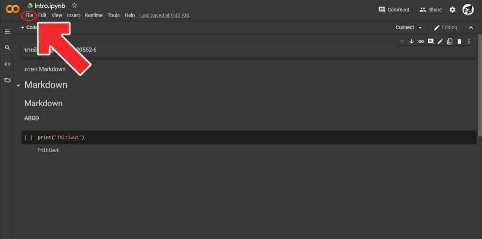
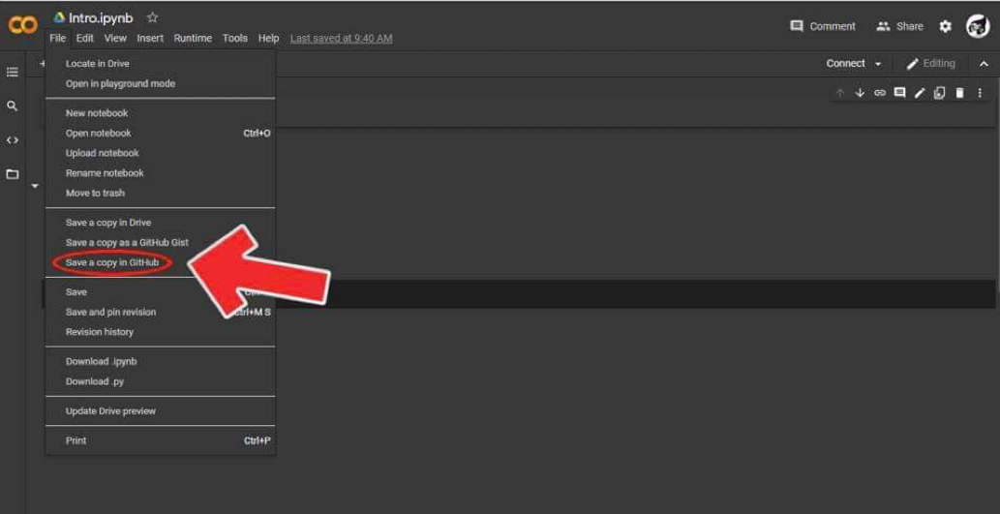
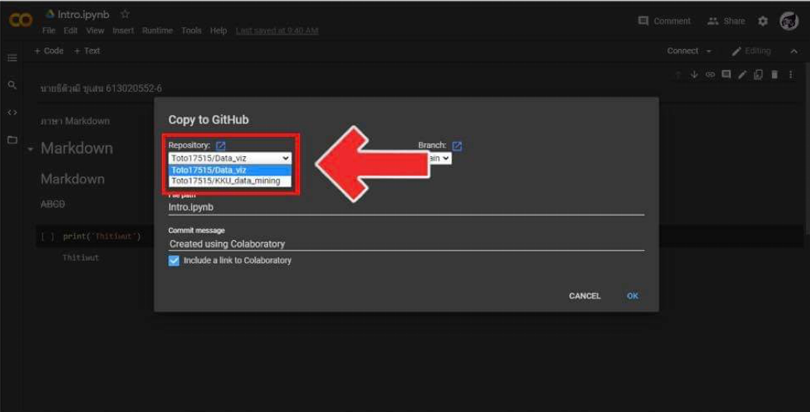
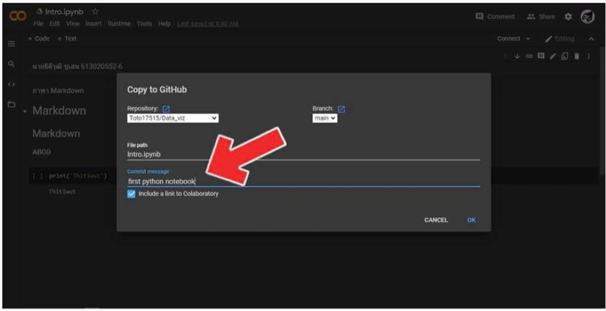

# data_viz

มะลิวรรณ ทองบุญมา 603021833-2

# การบ้านครั้งที่ 1 

ขั้นตอนการบันทึกไฟล์จาก Google colab ไปยัง github

# ขั้นตอนที่ 1 ไปยังเมนู file

# ขั้นตอนที่ 2 กดปุ่ม Save a copy in Github

# ขั้นตอนที่ 3 เลือกจัดเก็บไฟล์ใน Github

# ขั้นตอนที่ 4 พิมพ์ข้อความการเปลี่ยนแปลง (Commit Message)

# ขั้นตอนที่ 5 กดปุ่ม OK 

